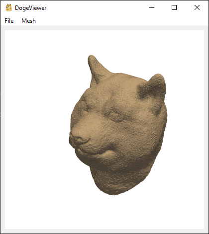

# PyVistaQt Standalone Application

Create a standalone 3D viewer application with [PyVistaQt](https://qtdocs.pyvista.org).

This repository provides a template for creating a Windows executable (`.exe`) of a
standalone PyVistaQt application.



## Features

- Bundle assets into the executable
- Create custom menus and actions
- Automated building on CI

## Locally Build

On any OS, you can create your own standalone application with:

```
pip install -r requirements.txt
pyinstaller main.spec
```

The executable will then be located in the `dist/main` directory. To distribute, you can zip this directory.


## Automatized Build

The GitHub Actions workflow here will build the Windows installable executable and upload as an artifact to the workflow run.

This workflow also contains a `Release` step which will upload the executable in the release on tag. Generate a tag with:

```
git tag v0.1.0
git push --tags
```

## License

This repository uses the MIT License. Contributions are welcome.
